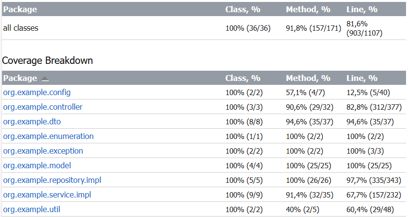

# Test coverage for CleverBankApp

#### Автор: Харлап Диана
#### email: dianaharlap19@gmail.com

## Покрытие тестами



## Запуск тестов

Для запуска тестов необходимо склонировать репозиторий, затем последовательно выполнить следующие команды:
```
cd ./server
gradle test
```

## Описание проекта

Репозиторий представляет собой две важные папки - сервер и клиент. Для работы с сервером или клиентом необходимо в первую очередь перейти в нужную папку.

Клиентами являются консольные приложения, взаимодействующие с сервером по протоколу HTTP. Для обращения к серверу клиент отправляет GET и POST HTTP-запросы используя библиотеку Unirest.

Для обработки HTTP-запросов и управления приложением сервер использует HTTP-сервлеты, что позволяет обрабатывать множество входящих запросов одновременно. Для развёртывания сервера был использован контейнер сервлетов Apache Tomcat (как локально, так и в Docker-контейнере).

Для хранения данных была развёрнута СУБД PostgreSQL (как локально, так и в контейнере). Для обеспечения целостности данных (при начислениях процентов, переводах, пополнениях и снятиях) были использованы транзакции.

## Реализованный функционал

1. Реализованы операции пополнения и снятия средств со счëта.
2. Реализована возможность перевода другому клиенту. При переводе используется транзакция (обеспечена целостность данных).
3. Реализована проверка на ежемесячное начисление процентов. Значение процента указано в конфигурационном файле .yml
4. После каждой операции формируется чек. Он сохраняется в папку "client/check" проекта в формате txt.
5. При разработке проекта применены шаблоны проектирования.
6. Код содержит документацию в формате JavaDoc.
7. Описана информация о проекте, написана инструкция по запуску проекта, описаны CRUD- операции над сущностями предметной области.
8. Реализованы unit-тесты.
9. Выписка по транзакциям формируется в формате PDF, сохраняется в папку "client/account-statement".
10. Реализованы CRUD-операции для всех сущностей. Интерфейс —  HTTP-эндпоинты.
11. Сформирован отчёт о количестве полученных и потраченных средств по счету за определённый период. Отчёт сохраняется в формате PDF в папку "client/money-statement".
12. Таблицы БД соответствуют 3НФ.

(Пункты из тестового задания 1,2,3,4,5,6,7,8,9,10,11(частично),12,13,14,15)

## Инструкция по запуску сервера и клиента

#### Локальный запуск сервера

В первую очередь необходимо открыть папку ./server.

Для запуска сервера необходимо иметь установленную на компьютер СУБД PostgreSQL и контейнер сервлетов Apache Tomcat.

1. Получить доступ к СУБД, создать пустую базу данных "dbCleverBank"
2. Используя SQL-скрипт generation.sql, который находится в папке "server/src/main/resources", инициализировать структуру базы данных.
3. Подготовить к работе контейнер сервлетов Apache Tomcat.
4. Находясь в папке "server" выполнить команду "./gradlew war".
5. Из папки "server/build/libs" скопировать war-архив.
6. Переименовать архив в ROOT.war
7. Открыть корневую папку Tomcat, перейти в папку "webapps", вставить архив ROOT.war
8. Перейти в папку "bin" корневой папки Tomcat, используя скрипт startup.sh запустить сервер
9. После выполненных действий сервер будет доступен по адресу localhost:8080.

#### Запуск клиенсткого приложения

Для запуска клиентского приложения необходимо открыть папку ./client как корень проекта и нажать на кнопку запуска ))

## Пример CRUD-операций

#### Операции над User

1. Получить информацию о пользователе

Пример запроса:
```http request
GET /api/v1/crud/users/{userId}
```

Пример ответа:
```json
{
    "id": 1,
    "firstName": "Kirill",
    "lastName": "Sotnikov",
    "patronymic": "Artemovich",
    "login": "kiril"
}
```

2. Создать запись о пользователе

Пример запроса:
```http request
POST /api/v1/crud/users
```

Пример тела запроса:
```json
{
    "firstName": "Kirill",
    "lastName": "Sotnikov",
    "patronymic": "Artemovich",
    "login": "kiril"
}
```

Пример ответа:
```json
{
    "id": 1,
    "firstName": "Kirill",
    "lastName": "Sotnikov",
    "patronymic": "Artemovich",
    "login": "kiril"
}
```
3. Обновить запись о пользователе

Пример запроса:
```http request
PUT /api/v1/crud/users/{userId}
```

Пример тела запроса:
```json
{
    "firstName": "Kirill",
    "lastName": "Sotnikov",
    "patronymic": "Nikolaevich",
    "login": "kiril"
}
```

Пример ответа:
```json
{
    "id": 1,
    "firstName": "Kirill",
    "lastName": "Sotnikov",
    "patronymic": "Nikolaevich",
    "login": "kiril"
}
```

4. Удалить запись о пользователе

Пример запроса:
```http request
DELETE /api/v1/crud/users/{userId}
```

#### Операции над Bank

1. Получить информацию о банке

Пример запроса:
```http request
GET /api/v1/crud/banks/{bankId}
```

Пример ответа:
```json
{
   "id": 1,
   "name": "Clever-Bank"
}
```

2. Создать запись о банке

Пример запроса:
```http request
POST /api/v1/crud/banks
```

Пример тела запроса:
```json
{
   "name": "Bank"
}
```

Пример ответа:
```json
{
   "id": 4,
   "name": "Bank"
}
```
3. Обновить запись о банке

Пример запроса:
```http request
PUT /api/v1/crud/banks/{bankId}
```

Пример тела запроса:
```json
{
   "name": "BankA"
}
```

Пример ответа:
```json
{
   "id": 1,
   "name": "BankA"
}
```

4. Удалить запись о банке

Пример запроса:
```http request
DELETE /api/v1/crud/banks/{bankId}


```

#### Операции над Account

1. Получить информацию об аккаунте

Пример запроса:
```http request
GET /api/v1/crud/accounts/{accountId}
```

Пример ответа:
```json
{
   "id": 1,
   "userId": 1,
   "bankId": 2,
   "balance": 1051.00,
   "currency": "BYN",
   "number": "1234567890",
   "createdDate": 1692738000000
}
```

2. Создать запись об аккаунте

Пример запроса:
```http request
POST /api/v1/crud/accounts
```

Пример тела запроса:
```json
{
   "userId": 1,
   "bankId": 2,
   "balance": 2.00,
   "currency": "BYN",
   "number": "1234567897",
   "createdDate": 1692738000000
}
```

Пример ответа:
```json
{
   "id": 4,
   "userId": 1,
   "bankId": 2,
   "balance": 2.00,
   "currency": "BYN",
   "number": "1234567897",
   "createdDate": 1692738000000
}
```
3. Обновить запись об аккаунте

Пример запроса:
```http request
PUT /api/v1/crud/accounts/{accountId}
```

Пример тела запроса:
```json
{
   "userId": 1,
   "bankId": 2,
   "balance": 2.00,
   "currency": "BYN",
   "number": "1234567897",
   "createdDate": 1692738000000
}
```

Пример ответа:
```json
{
   "id": 4,
   "userId": 1,
   "bankId": 2,
   "balance": 2000.00,
   "currency": "BYN",
   "number": "1234567897",
   "createdDate": 1692738000000
}
```

4. Удалить запись об аккаунте

Пример запроса:
```http request
DELETE /api/v1/crud/accounts/{accountId}
```


#### Операции над Transaction

1. Получить информацию о транзакции

Пример запроса:
```http request
GET /api/v1/crud/transactions/{transactionId}
```

Пример ответа:
```json
{
   "id": 74,
   "senderAccount": {
      "id": 1,
      "userId": 1,
      "bankId": 2,
      "balance": 1051.00,
      "currency": "BYN",
      "number": "1234567890",
      "createdDate": 1692738000000
   },
   "recipientAccount": null,
   "amount": 20.00,
   "time": "19:12:37",
   "date": 1693688400000,
   "type": "DEPOSIT"
}
```

2. Создать запись о транзакции

Пример запроса:
```http request
POST /api/v1/crud/transactions
```

Пример тела запроса:
```json
{
   "senderAccount": {
      "id": 1,
      "userId": 1,
      "bankId": 2,
      "balance": 1051.00,
      "currency": "BYN",
      "number": "1234567890",
      "createdDate": 1692738000000
   },
   "recipientAccount": {
      "id": 2,
      "userId": 2,
      "bankId": 1,
      "balance": 10.00,
      "currency": "BYN",
      "number": "0123456789",
      "createdDate": 1692738000000
   },
   "amount": 100.00,
   "time": "21:12:37",
   "date": 1693688400000,
   "type": "TRANSFER"
}
```

Пример ответа:
```json
{
   "id": 77,
   "senderAccount": {
      "id": 1,
      "userId": 1,
      "bankId": 2,
      "balance": 1051.00,
      "currency": "BYN",
      "number": "1234567890",
      "createdDate": 1692738000000
   },
   "recipientAccount": {
      "id": 2,
      "userId": 2,
      "bankId": 1,
      "balance": 10.00,
      "currency": "BYN",
      "number": "0123456789",
      "createdDate": 1692738000000
   },
   "amount": 100.00,
   "time": "21:12:37",
   "date": 1693688400000,
   "type": "TRANSFER"
}
```
3. Обновить запись о транзакции

Пример запроса:
```http request
PUT /api/v1/crud/transactions/{transactionId}
```

Пример тела запроса:
```json
{
   "senderAccount": {
      "id": 1,
      "userId": 1,
      "bankId": 2,
      "balance": 1051.00,
      "currency": "BYN",
      "number": "1234567890",
      "createdDate": 1692738000000
   },
   "recipientAccount": null,
   "amount": 100.00,
   "time": "19:12:37",
   "date": 1693688400000,
   "type": "DEPOSIT"
}
```

Пример ответа:
```json
{
   "id": 74,
   "senderAccount": {
      "id": 1,
      "userId": 1,
      "bankId": 2,
      "balance": 1051.00,
      "currency": "BYN",
      "number": "1234567890",
      "createdDate": 1692738000000
   },
   "recipientAccount": null,
   "amount": 100.00,
   "time": "19:12:37",
   "date": 1693688400000,
   "type": "DEPOSIT"
}
```

4. Удалить запись о транзакции

Пример запроса:
```http request
DELETE /api/v1/crud/transactions/{transactionId}
```